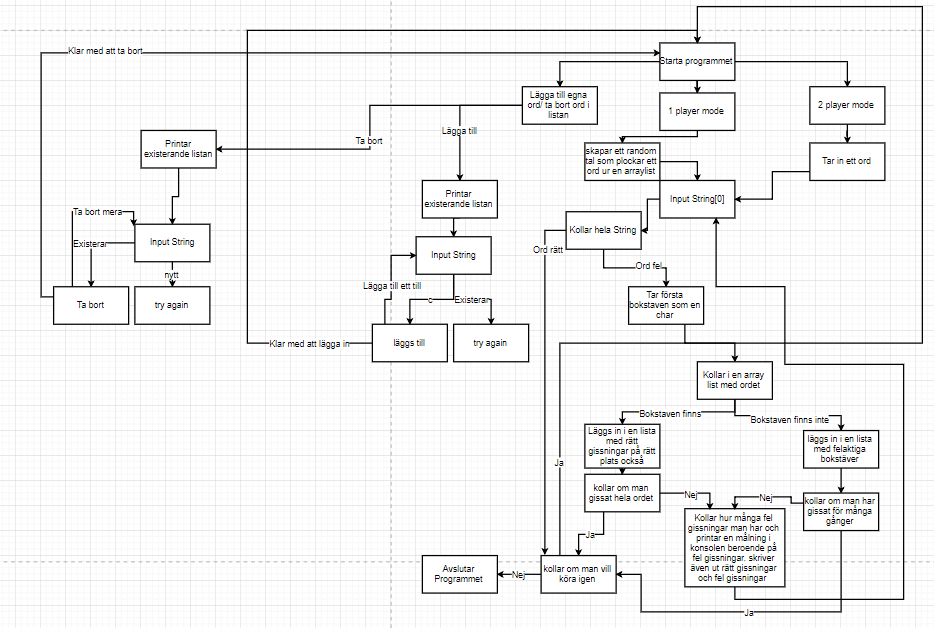

# HangMan Planning

### Steps

Kolla Programmering Planering.png för en guidad vy av vad som ska hända i programmet

- Tre arraylists: en med ord man ska gissa, en med alla felaktiga gissningar och en med giltiga gissningar
- Använder en Random Klass för att skapa ett tal som är mellan 0 och så många ord som lagts in
- sen tar den siffran som random klassen skapar och kollar vilket ord som ligger på den indexen och lägger in den i en ny array med ToCharArray
- Sen börjar man gissa
- kollar om antingen det är rätt ord annars så kollar den om char finns i ordet.
- om den finns så läggs den in och man får gissa igen
- om den inte finns så läggs den i en array med fel gissningar och så får man gissa igen
- ska även printa en hangman målning beroende på hur många fel man gjort
- man ska även kunna välja ord för sin kompis då är det samma som den andra men man väljer ordet man ska gissa
- man kommer också kunna ta bort och lägga till ord i listan och detta görs genom att använda en .json fil med en lista i

